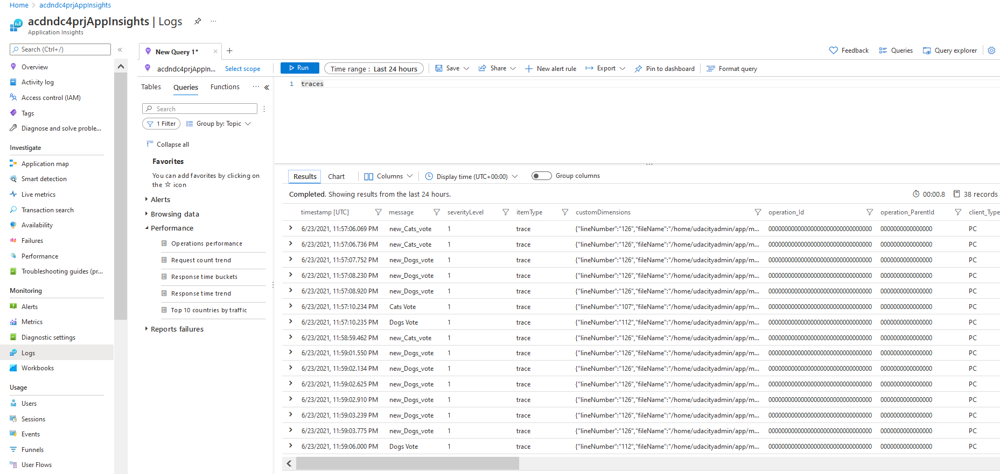

# Application Insights Screenshots

## main.py

In GitHub
https://github.com/HajimeK/nd081-c4-azure-performance-project-starter/blob/master/azure-vote/main.py

```
from flask import Flask, request, render_template
import os
import random
import redis
import socket
import sys
#import logging
from datetime import datetime

# App Insights
# TODO: Import required libraries for App Insights
from logging import INFO, getLogger
from opencensus.ext.azure.log_exporter import AzureLogHandler
from opencensus.ext.azure import metrics_exporter
from opencensus.ext.azure.trace_exporter import AzureExporter
from opencensus.trace.samplers import ProbabilitySampler
from opencensus.trace.tracer import Tracer
from opencensus.ext.flask.flask_middleware import FlaskMiddleware


app = Flask(__name__)

# Load configurations from environment or config file
app.config.from_pyfile('config_file.cfg')

InstrumentationKey= app.config['INSTRUMENTATIONKEY']
IngestionEndPoint = app.config['INGESTIONENDPOINT']
#connection_string = f'InstrumentationKey={InstrumentationKey};IngestionEndPoint={IngestionEndPoint}'
connection_string = f'InstrumentationKey={InstrumentationKey}'

# Logging
logger = getLogger(__name__)
handler = AzureLogHandler(connection_string=connection_string)
#handler.setLevel(INFO)
logger.setLevel(INFO)
logger.addHandler(handler)

# Metrics
exporter = metrics_exporter.new_metrics_exporter(
    enable_standard_metrics=True,
    connection_string=connection_string)
exporterArg = AzureExporter(connection_string=connection_string)

# Tracing
tracer = Tracer(exporter=exporter, sampler=ProbabilitySampler(1.0))

# Requests
middleware = FlaskMiddleware(
    app,
    exporter=exporterArg,
    sampler=ProbabilitySampler(rate=1.0),
)

if ("VOTE1VALUE" in os.environ and os.environ['VOTE1VALUE']):
    button1 = os.environ['VOTE1VALUE']
else:
    button1 = app.config['VOTE1VALUE']

if ("VOTE2VALUE" in os.environ and os.environ['VOTE2VALUE']):
    button2 = os.environ['VOTE2VALUE']
else:
    button2 = app.config['VOTE2VALUE']

if ("TITLE" in os.environ and os.environ['TITLE']):
    title = os.environ['TITLE']
else:
    title = app.config['TITLE']

# Redis Connection
r = redis.Redis()

# Change title to host name to demo NLB
if app.config['SHOWHOST'] == "true":
    title = socket.gethostname()

# Init Redis
if not r.get(button1): r.set(button1,0)
if not r.get(button2): r.set(button2,0)

@app.route('/', methods=['GET', 'POST'])
def index():

    if request.method == 'GET':

        # Get current values
        vote1 = r.get(button1).decode('utf-8')
        # TODO: use tracer object to trace cat vote
        tracer.span(name='Cats Vote')

        vote2 = r.get(button2).decode('utf-8')
        # TODO: use tracer object to trace dog vote
        tracer.span(name='Dogs Vote')

        # Return index with values
        return render_template("index.html", value1=int(vote1), value2=int(vote2), button1=button1, button2=button2, title=title)

    elif request.method == 'POST':

        if request.form['vote'] == 'reset':

            # Empty table and return results
            r.set(button1,0)
            r.set(button2,0)
            vote1 = r.get(button1).decode('utf-8')
            properties = {'custom_dimensions': {'Cats Vote': vote1}}
            # TODO: use logger object to log cat vote
            logger.info("Cats Vote", extra=properties)

            vote2 = r.get(button2).decode('utf-8')
            properties = {'custom_dimensions': {'Dogs Vote': vote2}}
            # TODO: use logger object to log dog vote
            logger.info("Dogs Vote", extra=properties)

            return render_template("index.html", value1=int(vote1), value2=int(vote2), button1=button1, button2=button2, title=title)

        else:

            # Insert vote result into DB
            vote = request.form['vote']
            r.incr(vote,1)

            # missing in Udacity code to reflect the current vote
            vote0 = r.get(vote).decode('utf-8')
            # log current vote
            properties = {'custom_dimensions': {'{}_vote'.format(vote): vote0}}
            logger.info('new_{}_vote'.format(vote), extra=properties)

            # Get current values
            vote1 = r.get(button1).decode('utf-8')
            vote2 = r.get(button2).decode('utf-8')

            # Return results
            return render_template("index.html", value1=int(vote1), value2=int(vote2), button1=button1, button2=button2, title=title)

if __name__ == "__main__":
    # comment line below when deploying to VMSS
    #app.run() # local
    app.run(host='0.0.0.0', threaded=True, debug=True)
    # uncomment the line below before deployment to VMSS
    # app.run(host='0.0.0.0', threaded=True, debug=True) # remote
```

##     The metrics from the VM Scale Set instance

this will show 
- CPU %
- Available Memory %
- Information about the Disk
- information about the bytes sent and received. 

All in one figures can be observed as below.
Each graph includes red and blue lines, which correspond to each 2 VMs in the VMSS.


## Application Insight Events which show the results of clicking 'vote' for each 'Dogs' & 'Cats'

## The output of the traces query in Azure Log Analytics.



## The chart created from the output of the traces query.

