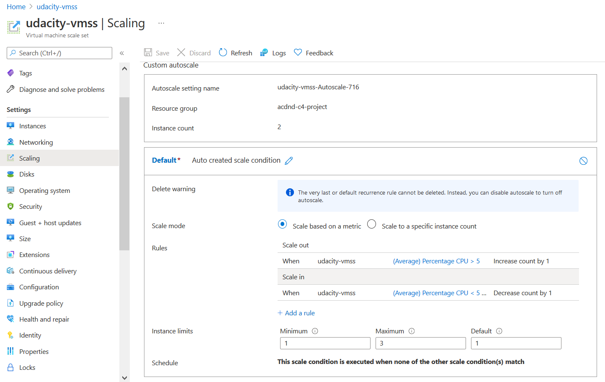
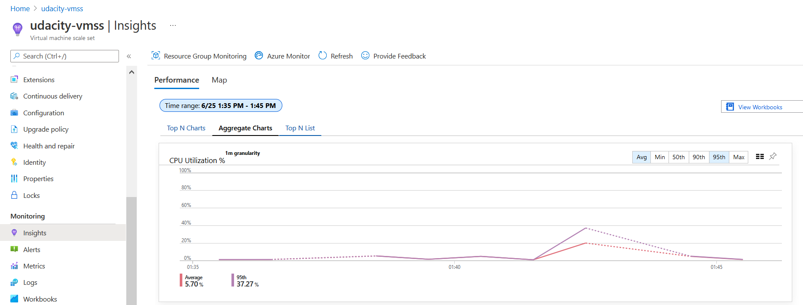
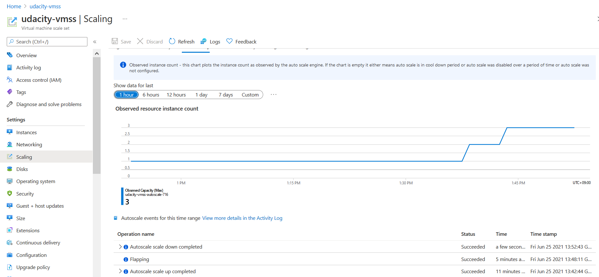
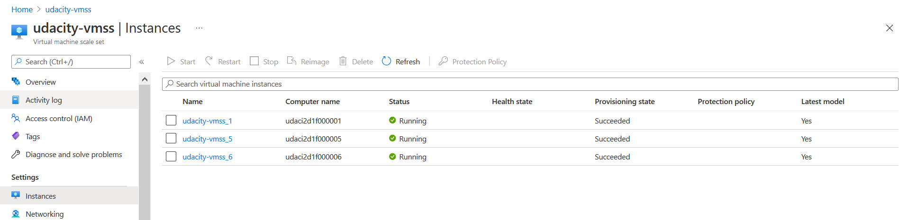
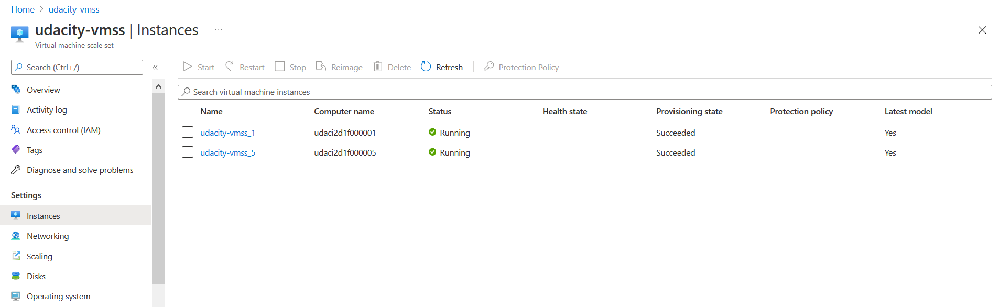
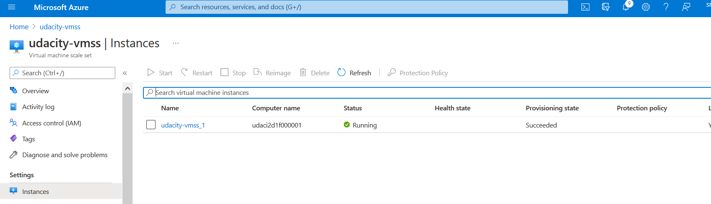
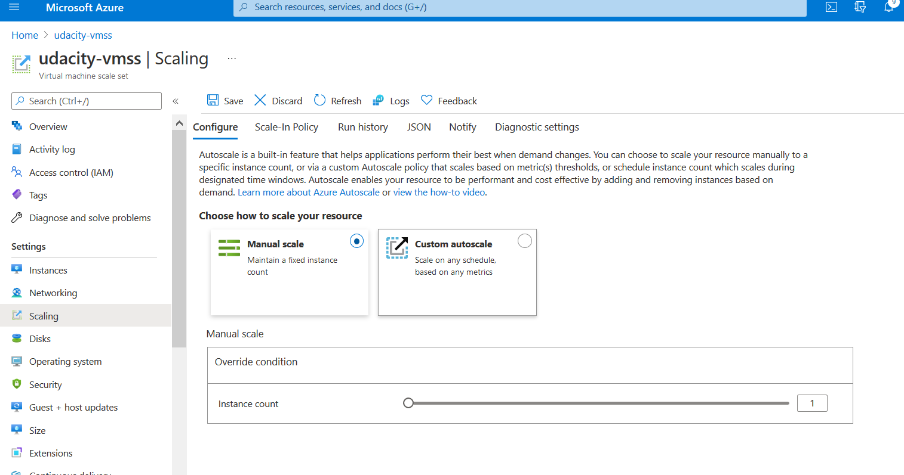

# Auto Scaling VMSS Screenshots

## For the VM Scale Set, create an autoscaling rule based on metrics


Autoscaling Rule


## Trigger the conditions for the rule, causing an autoscaling event

Around 1:30pm start making a workload.

Workload script
```
while true; do wget <VMSS external IP> & done
```

CPU utilization


When posing a high load, the system scales up automatically as defined.

The number of VMs increased.


The instances reached the maximum number defined in the autoscaling rule.


After a while since stopped posing a high workload, VM scales down as below.





## When complete, enable manual scale

