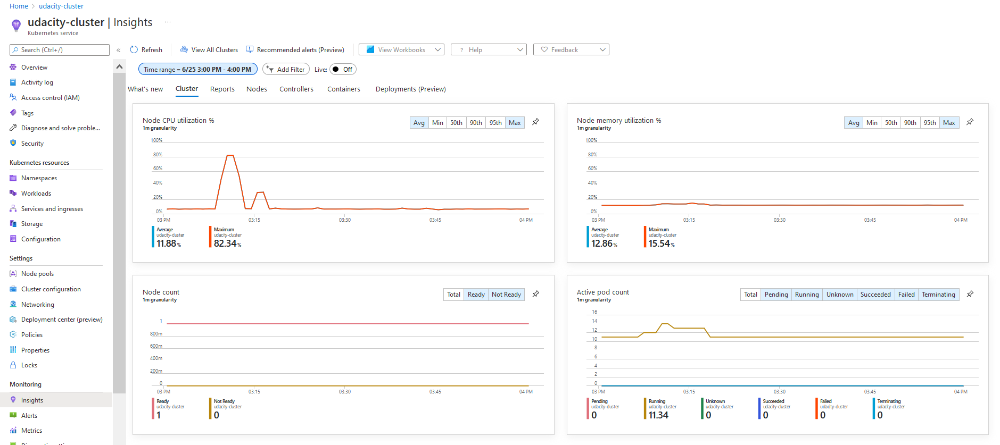
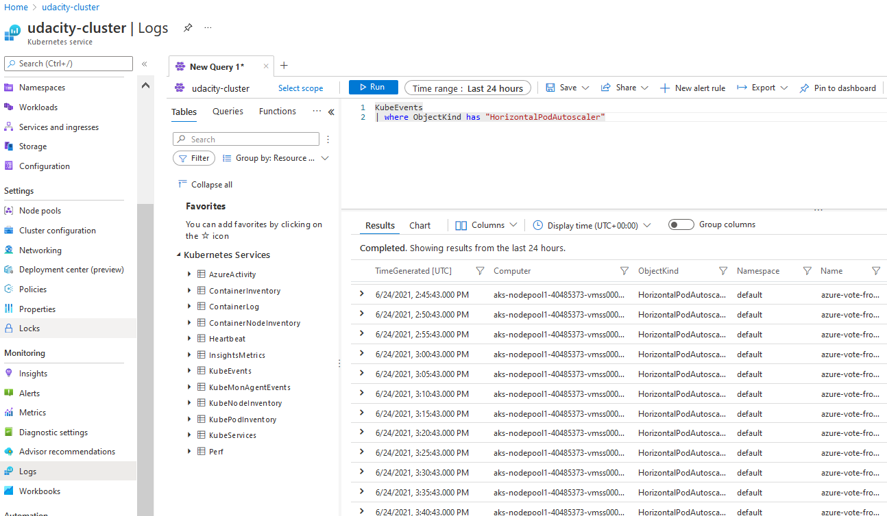
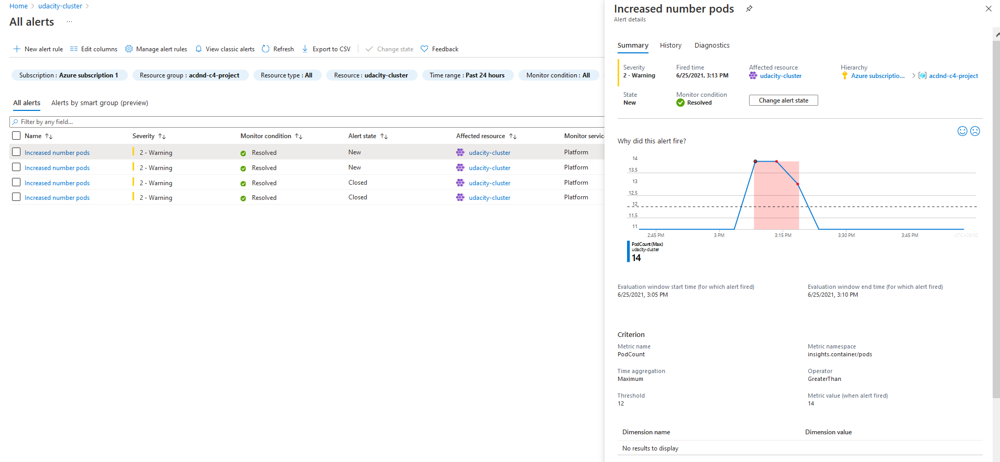
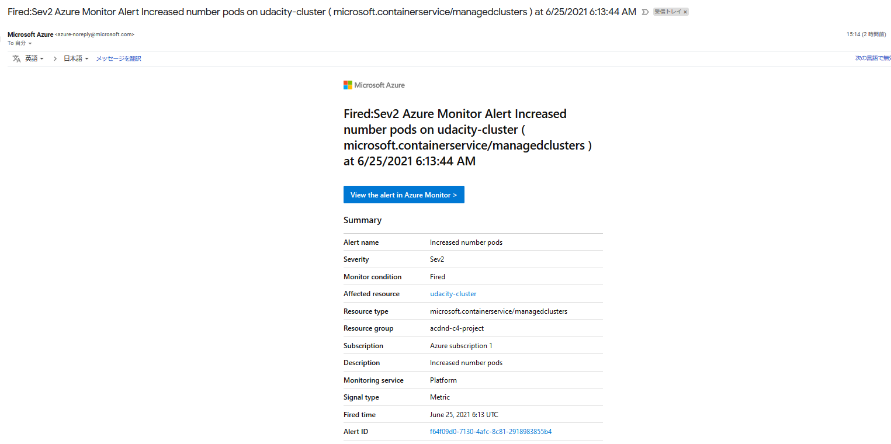

# Kubernetes Cluster Screenshots

Deployed the azure-vote app to the ACR and delpoyed to my cluster.


### The output of the Horizontal Pod Autoscaler, showing an increase in the number of pods.

#### Scaling configuration

Just after deploying the app, one pot is assigned for azure-vote-front as below.
```
hajimek@ubuntu:~/git/azure-voting-app-redis$ kubectl get pods
NAME                                READY   STATUS    RESTARTS   AGE
azure-vote-back-747fb77b85-75jv8    1/1     Running   0          15h
azure-vote-front-65f7448849-95qfd   1/1     Running   0          15h
```

Scaling is configured with min = 1 and max = 3 as below.
```
hajimek@ubuntu:~$ kubectl autoscale deployment azure-vote-front --cpu-percent=30 --min=1 --max=3
```

#### Posed high load and observed the scaling

Generated high work load as below.

```
hajimek@ubuntu:~/git/azure-voting-app-redis$ kubectl run -it --rm load-generator --image=busybox /bin/sh
If you don't see a command prompt, try pressing enter.
/ # while true; do wget -q -O- <external IP address of the cluster>; done
```

You can see the number of pods increased from 1 to 3 (see column *REPLICAS*) as defined after generated high work load.
And decresed from 3 to 1, after a wihle stopped that work load.

```
azure-vote-front   Deployment/azure-vote-front   0%/30%    1         3         1          18h
hajimek@ubuntu:~$ kubectl get hpa
NAME               REFERENCE                     TARGETS   MINPODS   MAXPODS   REPLICAS   AGE
azure-vote-front   Deployment/azure-vote-front   0%/30%    1         3         1          18h
hajimek@ubuntu:~$ kubectl get hpa
NAME               REFERENCE                     TARGETS   MINPODS   MAXPODS   REPLICAS   AGE
azure-vote-front   Deployment/azure-vote-front   0%/30%    1         3         1          18h
hajimek@ubuntu:~$ kubectl get hpa
NAME               REFERENCE                     TARGETS   MINPODS   MAXPODS   REPLICAS   AGE
azure-vote-front   Deployment/azure-vote-front   0%/30%    1         3         1          18h
hajimek@ubuntu:~$
hajimek@ubuntu:~$ kubectl get hpa
NAME               REFERENCE                     TARGETS   MINPODS   MAXPODS   REPLICAS   AGE
azure-vote-front   Deployment/azure-vote-front   0%/30%    1         3         1          18h
hajimek@ubuntu:~$ kubectl get hpa
NAME               REFERENCE                     TARGETS   MINPODS   MAXPODS   REPLICAS   AGE
azure-vote-front   Deployment/azure-vote-front   0%/30%    1         3         1          18h
hajimek@ubuntu:~$ kubectl get hpa
NAME               REFERENCE                     TARGETS   MINPODS   MAXPODS   REPLICAS   AGE
azure-vote-front   Deployment/azure-vote-front   0%/30%    1         3         1          18h
hajimek@ubuntu:~$ kubectl get hpa
NAME               REFERENCE                     TARGETS   MINPODS   MAXPODS   REPLICAS   AGE
azure-vote-front   Deployment/azure-vote-front   60%/30%   1         3         3          18h
hajimek@ubuntu:~$ kubectl get hpa
NAME               REFERENCE                     TARGETS   MINPODS   MAXPODS   REPLICAS   AGE
azure-vote-front   Deployment/azure-vote-front   60%/30%   1         3         3          18h
hajimek@ubuntu:~$ kubectl get hpa
NAME               REFERENCE                     TARGETS   MINPODS   MAXPODS   REPLICAS   AGE
azure-vote-front   Deployment/azure-vote-front   48%/30%   1         3         3          18h
hajimek@ubuntu:~$ kubectl get hpa
NAME               REFERENCE                     TARGETS   MINPODS   MAXPODS   REPLICAS   AGE
azure-vote-front   Deployment/azure-vote-front   48%/30%   1         3         3          18h
hajimek@ubuntu:~$ kubectl get hpa
NAME               REFERENCE                     TARGETS   MINPODS   MAXPODS   REPLICAS   AGE
azure-vote-front   Deployment/azure-vote-front   48%/30%   1         3         3          18h
hajimek@ubuntu:~$ kubectl get hpa
NAME               REFERENCE                     TARGETS   MINPODS   MAXPODS   REPLICAS   AGE
azure-vote-front   Deployment/azure-vote-front   0%/30%    1         3         3          18h
hajimek@ubuntu:~$ kubectl get hpa
NAME               REFERENCE                     TARGETS   MINPODS   MAXPODS   REPLICAS   AGE
azure-vote-front   Deployment/azure-vote-front   0%/30%    1         3         3          18h
hajimek@ubuntu:~$ kubectl get hpa
NAME               REFERENCE                     TARGETS   MINPODS   MAXPODS   REPLICAS   AGE
azure-vote-front   Deployment/azure-vote-front   0%/30%    1         3         3          18h
hajimek@ubuntu:~$ kubectl get hpa
NAME               REFERENCE                     TARGETS   MINPODS   MAXPODS   REPLICAS   AGE
azure-vote-front   Deployment/azure-vote-front   0%/30%    1         3         1          18h
```

You see the pods with below.
```
hajimek@ubuntu:~$ kubectl get pods
NAME                                READY   STATUS    RESTARTS   AGE
azure-vote-back-747fb77b85-75jv8    1/1     Running   0          19h
azure-vote-front-65f7448849-2wxl7   1/1     Running   0          7m12s
azure-vote-front-65f7448849-95qfd   1/1     Running   0          18h
azure-vote-front-65f7448849-jp5xs   1/1     Running   0          7m12s
load-generator                      1/1     Running   0          9m23s
```

In the portal, this also can be observed as below.

When workload becomes high, increased the number of pods for azure-vote-front to 3 as defined.


When workload becomes low, decreased the number of pods for azure-vote-front to 1 as defined.


### The Application Insights metrics which show the increase in the number of pods

CPU utilization spikes as below when workload is imposed.
It went over the threshold of *30%* which I defined.



We can see it in the portal log.




### The email you received from the alert when the pod count increased.

Alert mail is configured to be sent, when the number of pods exceeds 12 as below.



By configuring the alert, a mail was sent as bellow.




(cf: https://docs.microsoft.com/ja-jp/azure/aks/tutorial-kubernetes-prepare-app)