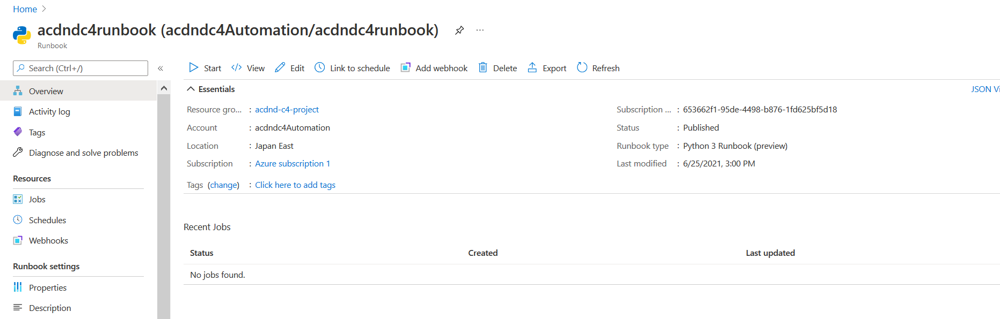
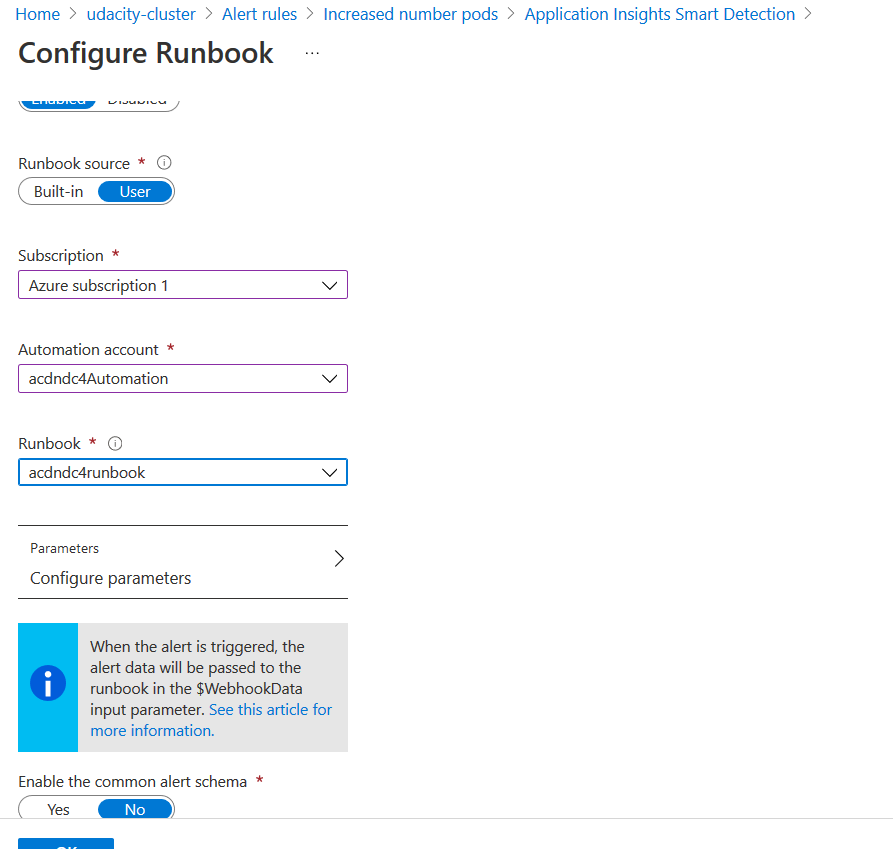
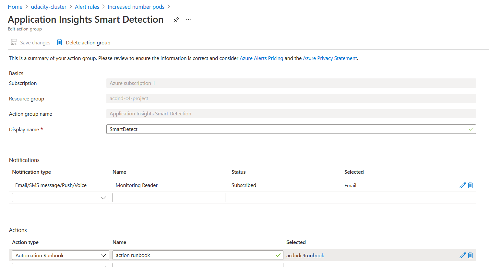
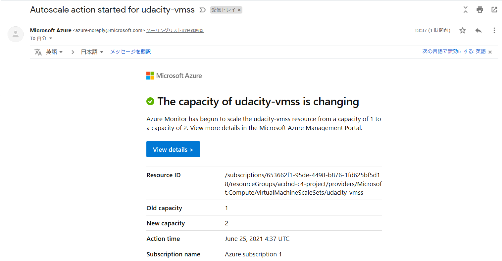
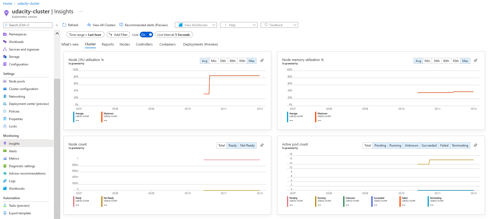
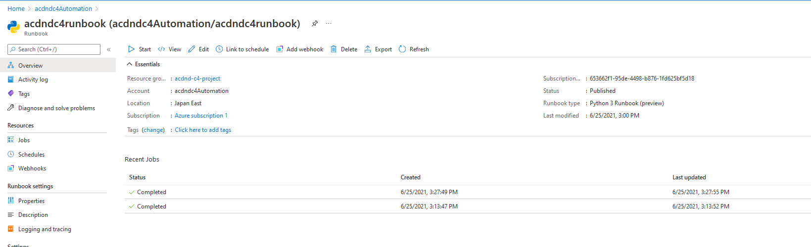
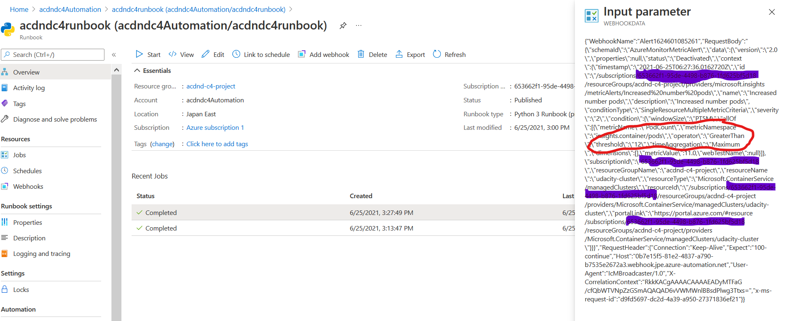

# RunBook Screenshots

Here in this RunBook execution, it it triggered by the heavy load on the Kubernetes pods.
When the number of pods increases in those cases, alerts are triggered.
There mails and RunBook are also accompanies.

The resource group used can be seen below.

## The alert configuration in Azure Monitor which shows the resource, condition, action group (this should include a reference to your Runbook), and alert rule details (may need 2 screenshots).

### Runbook

## The email you received from the alert when the Runbook was executed.

## The summary of the alert which shows 'why did this alert fire?', timestamps, and the criterion in which it fired.

As the workload increases, the number of pods increased.

## Runbook executed

more details. You can see the runbook was triggered by the pods number increase as designed.

